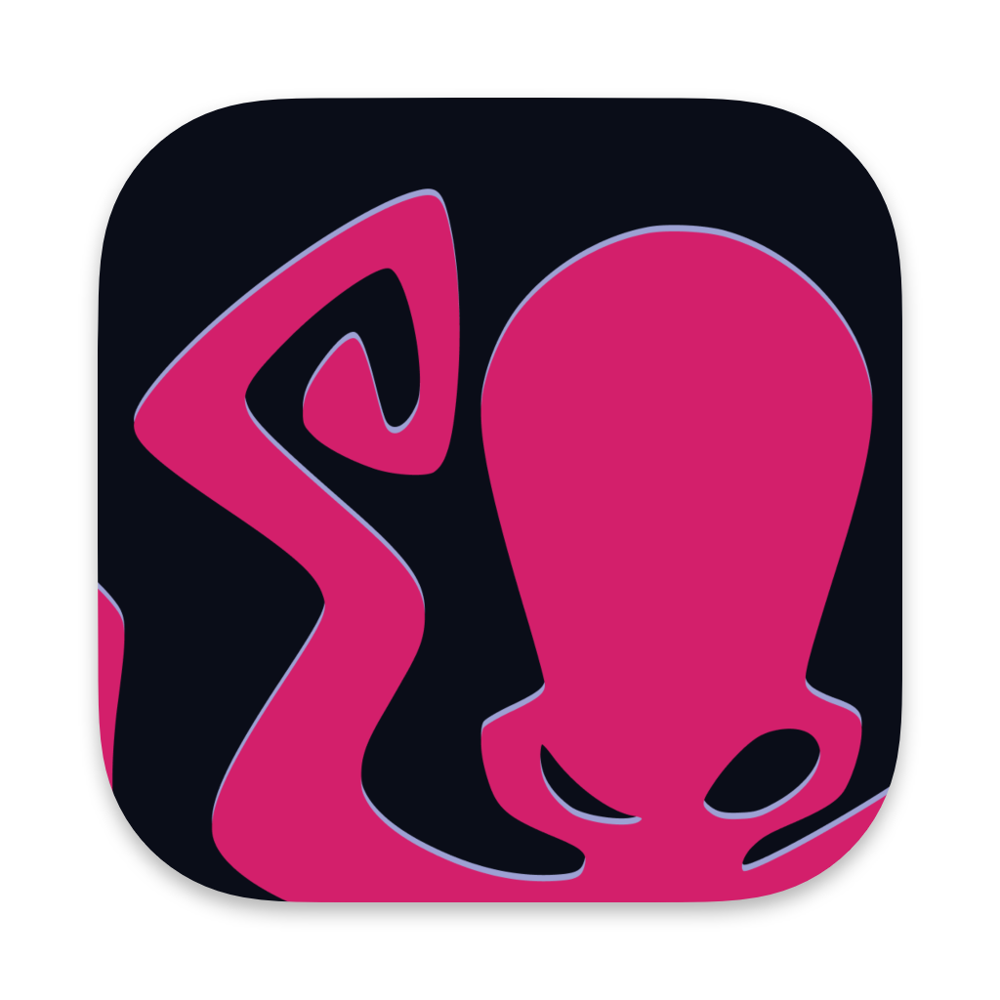

<div align="center">
  
  <h1>Kraken</h1>
  <p>A beautifully designed, deeply minimal AI Coding Agent built on Electron, Vue 3, and the Vercel AI SDK.</p>

  <p>
    <a href="https://github.com/NormVg/KrakenCode/blob/master/LICENSE"></a>
    
    
  </p>
</div>

## ✨ Features

- **Local First**: Seamlessly integrates with Ollama for entirely offline, private, zero-latency inference (e.g., `gemma4:31b-cloud`, `llama3`).
- **Cloud Ready**: Switch to remote Ollama servers when you need more compute.
- **Deeply Minimal Aesthetic**: A flat, utilitarian, native-feeling dark mode UI engineered for developers who love distraction-free coding.
- **True Streaming**: Connects directly via the Vercel AI SDK IPC streams to render tokens in real-time.
- **Rich Markdown Code Rendering**: Built-in `markstream-vue` with `shiki` syntax highlighting, displaying beautiful code blocks instantly as they generate.
- **Native macOS Feel**: Implements `hidden` title bars integrated flawlessly with macOS traffic lights for an elegant, first-class desktop experience.

## 🚀 Getting Started

### Prerequisites

- [Node.js](https://nodejs.org/) (v20+ recommended)
- [pnpm](https://pnpm.io/) (v10+ recommended)
- [Ollama](https://ollama.com/) (If running local models)

### Installation

1. **Clone the repository:**
   ```bash
   git clone https://github.com/NormVg/KrakenCode.git
   cd KrakenCode
   ```

2. **Install dependencies:**
   ```bash
   pnpm install
   ```

3. **Start the development server:**
   ```bash
   pnpm run dev
   ```

### Building for Production

Kraken uses `electron-builder` to package cross-platform native binaries.

```bash
# Build for macOS (produces Kraken.app)
pnpm run build:mac

# Build for Windows
pnpm run build:win

# Build for Linux
pnpm run build:linux
```

## 🛠️ Tech Stack

- **Framework**: [Electron Vite](https://electron-vite.org/)
- **Frontend**: [Vue 3](https://vuejs.org/) (Composition API) + [Pinia](https://pinia.vuejs.org/)
- **AI Integration**: [Vercel AI SDK](https://sdk.vercel.ai/) & `ai-sdk-ollama`
- **Markdown**: `markstream-vue` + `shiki`

## 🤝 Contributing

Contributions, issues, and feature requests are welcome!

1. Fork the Project
2. Create your Feature Branch (`git checkout -b feature/AmazingFeature`)
3. Commit your Changes (`git commit -m 'Add some AmazingFeature'`)
4. Push to the Branch (`git push origin feature/AmazingFeature`)
5. Open a Pull Request

## 📄 License

Distributed under the MIT License. See `LICENSE` for more information.
